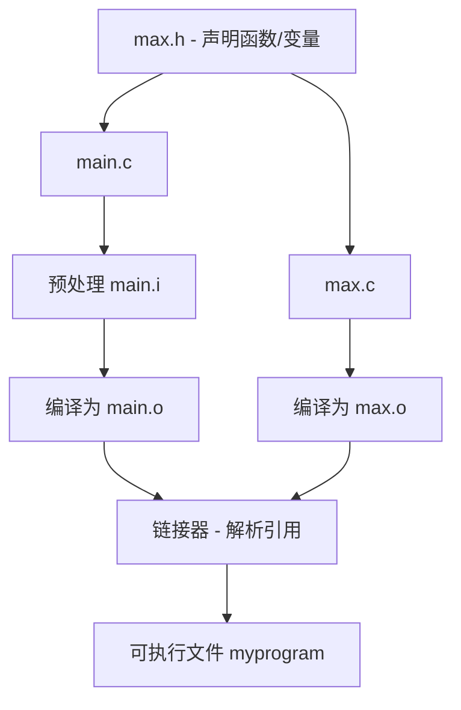

# 多个源代码文件

## 为什么需要拆分源代码

程序开发中，我们通常需要拆分源代码到多个文件中的原因：

1. **代码组织** - 单个文件过大时难以浏览和维护
2. **功能模块化** - 将相关功能集中到各自文件中
3. **团队协作** - 多人可同时进行开发而不互相干扰
4. **代码复用** - 核心功能可被多个项目使用

## 编译单元的概念

在C语言中，每个`.c`文件被称为一个"编译单元"：

- 编译器一次只能处理一个编译单元
- 每个编译单元独立编译，生成一个目标文件(`.o`或`.obj`)
- 最终由链接器将所有目标文件连接成可执行程序

```c
// main.c - 一个编译单元
#include <stdio.h>
#include "max.h" 

int main(void)
{
    int a = 5;
    int b = 6;
    printf("%d\n", max(a, b));
    printf("全局变量 gAll 的值: %d\n", gAll);
    return 0;
}
```

```c
// max.c - 另一个编译单元
#include "max.h"

int gAll = 12;
int max(int a, int b)
{
    return (a > b) ? a : b;
}
```

## 多文件程序结构的创建方式

### 🧾 文件结构示例

```
project/
├── main.c         // 主程序
├── max.h          // 函数声明（头文件）
└── max.c          // 函数实现
```

### 集成开发环境(IDE)中创建

在IDE（如Dev-C++、Visual Studio等）中创建多文件程序需要：

1. 创建一个项目（Project）
2. 向项目中添加源文件
3. 通过项目管理器组织文件

大多数IDE要求即使只有一个源文件也必须创建项目，但有些IDE（如Dev-C++）在单文件情况下可以不用项目。

### ⚙️ 编译流程概述

不使用IDE时，可以通过命令行编译多个源文件：

```bash
gcc main.c max.c -o program
```

或者分步编译后链接：

```bash
gcc -c main.c    # 仅编译，生成main.o
gcc -c max.c     # 仅编译，生成max.o
gcc main.o max.o -o program  # 链接目标文件
```

#### 编译流程步骤：

1. **预处理**（Preprocessing）  
    `#include "max.h"` 被替换成头文件内容。
    
2. **编译**（Compilation）  
    编译器分别把 `main.c` 和 `max.c` 编译成 `main.o` 和 `max.o`。
    
3. **汇编**（Assembly）  
    生成机器码的目标文件。
    
4. **链接**（Linking）  
    将 `main.o` 和 `max.o` 中的符号（函数、变量）链接起来。
    

---

###  🖼️ Mermaid 图示：编译 & 链接流程



> ✅ `main.c` 和 `max.c` 都引用了 `max.h`，函数 `max` 的定义来自 `max.c`，链接器最终将其与 `main.o` 连接起来。

---
### 一个实际例子

当编译上面的例子时：

1. **预处理阶段**：
   - `main.c`中的`#include "max.h"`被替换为max.h的内容
   - 此时编译器只知道有一个函数`max()`和变量`gAll`的声明

2. **编译阶段**：
   - 编译器编译`main.c`，生成`main.o`，其中包含对`max()`和`gAll`的引用
   - 编译器编译`max.c`，生成`max.o`，其中包含`max()`和`gAll`的实际定义

3. **链接阶段**：
   - 链接器将`main.o`和`max.o`链接在一起
   - 将`main.o`中对`max()`和`gAll`的引用解析到`max.o`中的实际定义
   - 最终生成一个完整的可执行程序

### 预处理阶段的工作

当源文件中包含`#include "max.h"`指令时，预处理器会：
1. 查找`max.h`文件
2. 将头文件的整个内容插入到包含该指令的位置
3. 本质上是简单的文本替换，不做语法检查

### 为什么包含头文件而不是`.c`文件

虽然技术上可行，但这么做会破坏模块化设计，并可能导致：

- 函数重复定义错误（多个文件都 `#include` 同一个 `.c`）
    
- 编译速度慢、可维护性差（修改函数实现就需要重新编译所有包含`.c`的文件）

## 常见问题与解决方法

1. **未定义的引用（Undefined reference）**：
   ```
   undefined reference to 'max'
   ```
   原因：链接器找不到函数实现（可能忘记编译包含函数定义的`.c`文件）
   
   实际情况：如果编译时只包含`main.c`而忘记了`max.c`，链接器就找不到`max()`的实现

2. **符号重复定义**：
   ```
   multiple definition of 'gAll'
   ```
   原因：同一个符号在多个编译单元中被定义
   解决：使用`extern`关键字和头文件正确声明

3. **头文件找不到**：
   ```
   fatal error: max.h: No such file or directory
   ```
   原因：头文件路径错误或文件不存在
   解决：检查头文件路径或使用`-I`选项指定头文件目录

### ⚙️ 简单 Makefile 示例[^1]

```makefile
program: main.o max.o
	gcc main.o max.o -o program

main.o: main.c max.h
	gcc -c main.c

max.o: max.c max.h
	gcc -c max.c

clean:
	rm -f *.o program
```

### 📌 注意事项

- 如果不编译 `max.c`，链接时会报错 `undefined reference`。
    
- `#include "file.h"` 是预处理器行为，本质是把 `.h` 文件内容插入源代码中。
    
- **头文件只是声明，不包含函数体；真正的函数定义在** `.c` **文件中**。
    
- 修改 `.h` 文件后，所有包含它的 `.c` 文件都需要重新编译。
    
- 修改实现文件`.c`，只需重新编译该文件，然后重新链接

[^1]: 在大型项目中，通常会使用构建系统如Make、CMake等来管理复杂的编译依赖关系。 

