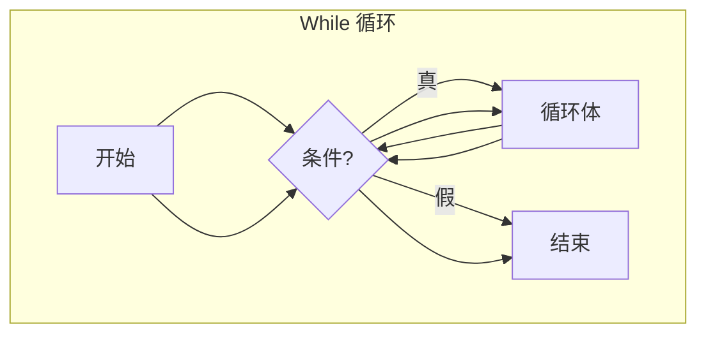
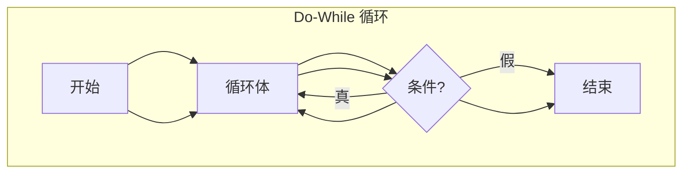

# 4.1 while 与 do-while 循环

有些重复性的任务，如果仅用 `if` 语句来解决，代码会变得冗长且难以扩展。例如，计算一个整数有多少位，如果用 `if` 判断范围，对于位数不确定的整数就很难处理。循环结构正是为了解决这类需要重复执行某段代码的问题而设计的。

## 循环的需求：为何 `if` 不够用

考虑计算一个正整数位数的任务：

-   **方法一：基于范围的 `if-else if`**
    -   判断 `x > 999` (四位数), `else if x > 99` (三位数), `else if x > 9` (两位数), `else` (一位数)。
    -   **缺点**：
        -   只能处理固定范围内的位数（如最多四位）。
        -   无法处理任意位数的正整数。为支持更多位数，需要不断添加 `else if` 分支。

-   **方法二：模拟"数数"**
    -   人看到一长串数字时，会逐位去数。
    -   计算机可以通过数学运算模拟这个过程。
    -   **核心操作**：
        1.  `x % 10`：获取最右边的数字（个位数）。(虽然本例没直接用，但常用于分解数字)
        2.  `x /= 10`：移除最右边的数字（整数除法）。
    -   **思路**：不断移除最右边的数字，同时计数，直到数字变成 0。
        ```c
        // 伪代码
        计数器 count = 0;
        只要 x 还大于 0 {
            x = x / 10;  // 移除一位
            count = count + 1; // 计数加一
        }
        输出 count;
        ```
    -   这种"只要条件满足就重复做"的逻辑，正是循环语句要解决的问题。

## `while` 循环

`while` 循环是最基本的循环结构，它会在**每次循环开始前**检查条件。只有条件为真 (true)，才会执行循环体内的语句。

-   **基本语法**:
    ```c
    while ( <循环条件> ) {
        // 循环体语句
        // 通常包含改变循环条件相关的操作
    }
    ```
-   **执行流程**:
    1.  判断 `<循环条件>` 是否为真 (非零)。
    2.  如果为假 (零)，跳过整个 `while` 循环，执行后续代码。
    3.  如果为真，执行 `{}` 中的循环体语句。
    4.  执行完循环体后，**回到步骤 1**，重新判断条件。
-   **类比 `if`**: `while` 就像一个可以重复执行的 `if`。`if` 条件满足只执行一次，`while` 条件满足会一直执行，直到条件不再满足。
-   **示例：计算正整数位数**
    ```c
    #include <stdio.h>

    int main() {
        int x;
        int count = 0; // 初始化计数器

        printf("请输入一个正整数: ");
        scanf("%d", &x);

        // 处理特殊情况：输入 0
        if (x == 0) {
            count = 1; 
        } else {
             // 使用 while 循环处理正整数
            int temp_x = x; // 使用临时变量，避免修改原始 x (如果后续还需要原始值)
            while (temp_x > 0) {
                temp_x /= 10; // 移除最右一位
                count++;      // 计数器加 1
            }
        }


        printf("数字 %d 是 %d 位数\n", x, count); // 如果用了临时变量，这里应输出原始 x

        return 0;
    }
    ```
    <!-- 助理提示：上述代码示例仅为演示 while 循环。实际应用中，对于x=0的情况，原视频通过 do-while 处理更简洁。此示例假设输入为正整数，并增加了对0的单独处理说明 while 特性。 -->
-   **注意**: 循环体内必须有能够最终改变循环条件的语句（如 `temp_x /= 10`），否则可能导致**死循环**。

## `do-while` 循环

`do-while` 循环与 `while` 类似，但它保证循环体**至少会执行一次**，因为它是在**每次循环结束后**才检查条件。[^1]。

-   **基本语法**:
    ```c
    do {
        // 循环体语句
    } while ( <循环条件> ); // 注意这里必须有分号!
    ```
-   **执行流程**:
    1.  执行 `{}` 中的循环体语句。
    2.  判断 `<循环条件>` 是否为真 (非零)。
    3.  如果为真，回到步骤 1，继续执行循环体。
    4.  如果为假 (零)，结束循环，执行后续代码。
-   **特点**: 循环体至少执行一次。
-   **示例：计算整数位数 (改进版)**
    `do-while` 特别适合处理像计算位数这种，即使输入是 0（0是一位数），也需要进行一次操作（n++）的情况。
    ```c
    #include <stdio.h>

    int main() {
        int x;
        printf("请输入一个非负整数: ");
        scanf("%d", &x);

        int n = 0; // 位数计数器
        int original_x = x; // 保存原始值用于输出

        if (x == 0) {
             n = 1; // 特殊处理0，直接设位数为1
        } else {
            // 对于非零数，使用do-while
            do {
                x /= 10;
                n++;
            } while (x > 0);
        }


        printf("数字 %d 是 %d 位数\n", original_x, n);

        return 0;
    }
    ```
     <!-- 助理提示：原视频中的 do-while 示例更简洁，未显式处理 x=0，而是依靠 do-while 至少执行一次的特性，使得 x=0 时也能正确得到 n=1。这里为了对比两种循环，给出了更清晰但稍显啰嗦的版本。原视频的写法是：`int n = 0; do { x /= 10; n++; } while (x > 0);` -->
-   **注意**: `while (...)` 后面必须有分号 `;`。

## `while` vs `do-while`

| 特性         | `while` 循环                 | `do-while` 循环              |
| :----------- | :--------------------------- | :--------------------------- |
| **条件判断** | 循环前 (Entry-condition)     | 循环后 (Exit-condition)      |
| **执行次数** | 可能 0 次                   | 至少 1 次                   |
| **适用场景** | 不确定是否需要执行循环体     | 至少需要执行一次循环体的情况 |
| **语法结尾** | `while (...) { ... }`        | `do { ... } while (...);` (有分号) |

**流程图对比**:





选择哪种循环取决于具体逻辑：是否需要确保循环体至少执行一次。

[^1]: 也就意味着同样的**循环条件**，`do-while`会**少判断**一次，但是不影响循环退出时机。
