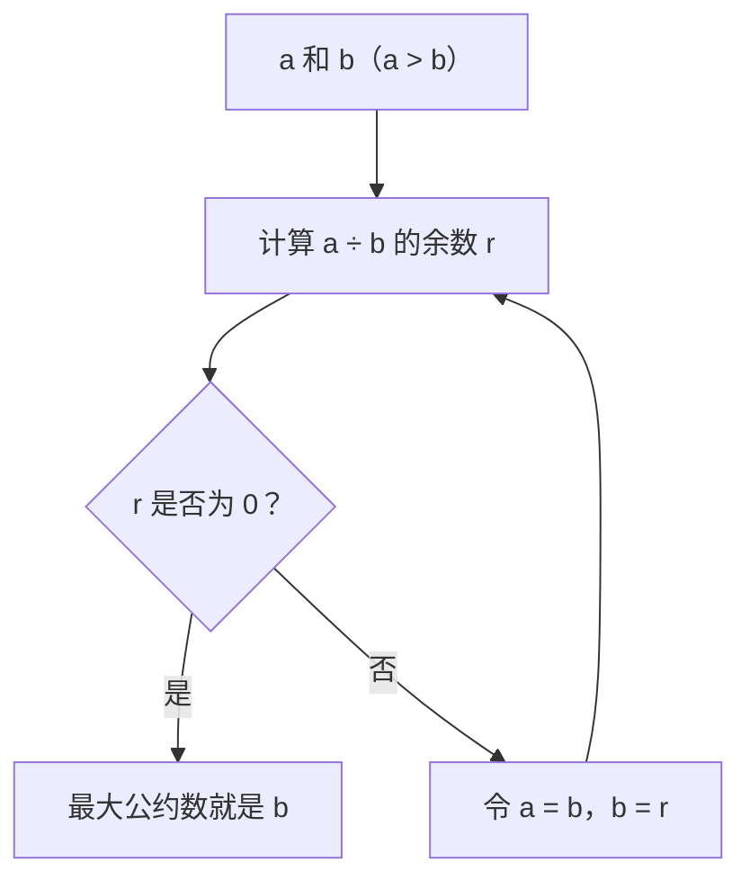

# 5.3 for 循环应用实例

`for` 循环由于其结构清晰，特别适合处理计数、遍历和有明确范围的迭代任务。

## 级数求和

计算数学级数的前 n 项和是 `for` 循环的经典应用。

**示例 1：计算 S = 1 + 1/2 + 1/3 + ... + 1/n**

```c
#include <stdio.h>

int main() {
    int n;
    printf("请输入 n: ");
    scanf("%d", &n);

    double sum = 0.0; // 使用 double 存储和，避免精度损失
    int i;

    for (i = 1; i <= n; i++) {
        // sum += 1 / i; // 错误！整数除法，结果大部分为 0
        sum += 1.0 / i; // 正确！1.0 是 double 类型，触发浮点数除法
    }

    // 输出 f(n) = sum 的格式
    printf("f(%d) = %.6f\n", n, sum); // %.6f 控制输出6位小数

    return 0;
}
```
-   **关键点**:
    -   使用 `double` 类型存储 `sum`。
    -   进行浮点数除法 `1.0 / i`，而不是整数除法 `1 / i`。
    -   循环变量 `i` 从 1 迭代到 `n`。

**示例 2：计算交错级数 S = 1 - 1/2 + 1/3 - 1/4 + ... + (-1)^(n+1) * (1/n)**

在上一示例基础上，需要引入一个交替变化的符号。

```c
#include <stdio.h>
#include <math.h> // 为了 pow 函数，但这里用 sign 变量更好

int main() {
    int n;
    printf("请输入 n: ");
    scanf("%d", &n);

    double sum = 0.0;
    int i;
    int sign = 1; // 符号变量，初始为正

    for (i = 1; i <= n; i++) {
        sum += sign * (1.0 / i); // 乘以符号
        sign = -sign;           // 每次循环后符号取反
    }

    // 或者，直接用数学判断奇偶性来决定符号
    // double sum = 0.0;
    // int i;
    // for (i = 1; i <= n; i++) {
    //     if (i % 2 != 0) { // i 是奇数，项为正
    //         sum += 1.0 / i;
    //     } else { // i 是偶数，项为负
    //         sum -= 1.0 / i;
    //     }
    // }


    printf("交错级数 f(%d) = %.6f\n", n, sum); 

    return 0;
}
```
-   **方法**: 使用一个 `sign` 变量，在每次迭代后乘以 -1，使其在 +1 和 -1 之间切换。或者判断 `i` 的奇偶性。

## 整数分解回顾

分解整数的各位数字是循环的常见应用，之前用 `while` 实现过，用 `for` 也可以，但 `while(x > 0)` 通常更自然。核心操作不变：
-   取个位: `digit = x % 10;`
-   移除个位: `x /= 10;`

```c
// 示例：计算各位数字之和
#include <stdio.h>

int main() {
    int number = 12345;
    int sum_of_digits = 0;
    int original_number = number; // 保存原始值

    // 使用 for 循环，但条件依赖 number 的变化，更像 while
    for (; number > 0; number /= 10) { 
        int digit = number % 10;
        sum_of_digits += digit;
    }
    // 注意：循环结束后 number 的值会变为 0

    printf("数字 %d 的各位数字之和是: %d\n", original_number, sum_of_digits);

    return 0;
}

```
虽然语法上可行，但这种 `for` 的写法（省略初始化和步进，步进逻辑隐含在条件变量的变化中）不如 `while(number > 0)` 直观。

## 求最大公约数 (GCD - Greatest Common Divisor)

**方法一：枚举法 (Brute Force / Enumeration)**

-   **思路**: 从 1 开始，逐个测试直到 `a` 和 `b` 中较小的那个数，找到能同时整除 `a` 和 `b` 的最大整数。
-   **实现**:
    ```c
    #include <stdio.h>

    int main() {
        int a = 12, b = 18; // 示例输入
        int gcd = 1; // 初始化为 1，因为 1 总是公约数
        int min_val = (a < b) ? a : b; // 找到 a 和 b 中的较小值
        
        // 逻辑优化：从较小数开始递减查找，第一个找到的就是最大的
        for (int i = min_val; i >= 1; i--) { 
            if (a % i == 0 && b % i == 0) { // i 能同时整除 a 和 b
                gcd = i;
                break; // 找到最大的了，立即跳出循环
            }
        }

        // 原视频的递增查找方式：
        // for (int i = 1; i <= min_val; i++) {
        //     if (a % i == 0 && b % i == 0) {
        //         gcd = i; // 不断更新 gcd 为当前找到的公约数
        //     }
        // }
        // // 循环结束后，gcd 保存的是最后一个（即最大的）公约数

        printf("%d 和 %d 的最大公约数是: %d\n", a, b, gcd);

        return 0;
    }
    ```
-   **缺点**: 效率不高，需要测试很多不必要的数。如果 a 或 b 很大，循环次数会很多。

**方法二：辗转相除法（欧几里得算法 Euclidean Algorithm)**

-   **原理**[^1]: 两个整数 `a` 和 `b`（假设 `a > b`）[^2]的最大公约数等于 `b` 和 `a % b`（`a` 除以 `b` 的余数）的最大公约数。反复应用这个规则，直到余数为 0，此时另一个数（除数）就是原始 `a` 和 `b` 的最大公约数。
    -   `gcd(a, b) = gcd(b, a % b)`
    -   当 `a % b == 0` 时，`gcd(a, b) = b`。
    - 
-   **算法步骤**:
    1.  输入 `a`, `b`。
    2.  当 `b` 不等于 0 时，重复执行：
        *   计算余数 `t = a % b`。
        *   更新 `a = b`。
        *   更新 `b = t`。
    3.  循环结束时（`b` 等于 0），`a` 的值就是最大公约数。

-   **实现**:
    ```c
    #include <stdio.h>

    int main() {
        int a = 18, b = 12; // 示例输入
        int original_a = a, original_b = b; // 保存原始值用于输出
        int t;

        while (b != 0) {
            t = a % b; // 计算余数
            a = b;     // 更新 a
            b = t;     // 更新 b
            printf("中间步骤: a=%d, b=%d, t=%d\n", a, b, t); // 可选：打印中间步骤
        }
        // 循环结束时，b 为 0，a 保存了 GCD

        printf("%d 和 %d 的最大公约数是: %d\n", original_a, original_b, a);

        return 0;
    }
    ```
-   **过程示例 (a=18, b=12)**:
    1.  `b=12 != 0` ` t = 18 % 12 = 6` `a=12, b=6`
    2.  `b=6 != 0` `t = 12 % 6 = 0` `a=6, b=0`
    3.  `b=0`, 循环结束。`GCD = a = 6`
-   **优点**: 效率远高于枚举法，是求 GCD 的标准算法。

[^1]:  - 找`a`和`b`的最大公约数，那`a`和`b`就肯定是那个最大公约数（记作 ***d***）的倍数， 他们之间的差也是 ***d*** 的倍数，所以我们可以通过“除法”，再把这个余数和前一个除数继续比较，因为它们都是 ***d*** 的倍数。这个过程一直重复，直到余数是0，那剩下的就是这两个数的最大公约数。
	---
	- 除法相当于`a - b * q = r`，因为`b`是 ***d*** 的倍数，所以不管`×`几都是 ***d*** 的倍数，所以除法可以求得他们之间最小的 ***d*** 的倍数的值，相当于`r`=两个最大公约数的倍数相减的差，也就是余数。

^37014b

[^2]: 如果`a<b`，那么第一次进行`%`时就会商=`0`，余数等于`a`（交换数值）

^1f1afc
