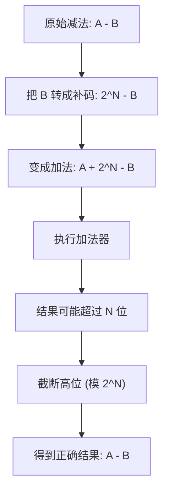

# 7.1 基本数据类型

C 语言是一种**有类型**的语言，这意味着所有变量在使用前必须先声明其类型。类型决定了变量可以存储什么样的数据以及如何解释这些数据。

## C 语言基础数据类型概览

C 语言的基础数据类型主要分为几类：

*   **整数类型**: 用于表示没有小数部分的数字。
    *   `char`: 通常用于存储单个字符，但本质上是最小的整数类型。占用 1 个字节。
    *   `short` (`short int`): 短整数。通常占用 2 个字节。
    *   `int`: 基本整数类型。大小通常与计算机的**字长**（Word Size）相关，常见为 4 或 8 字节。
    *   `long` (`long int`): 长整数。大小可能与 `int` 相同或更大，常见为 4 或 8 字节。
    *   `long long` (`long long int`): 更长的整数 (C99 标准引入)。通常占用 8 个字节。
    *   **无符号版本**: 在上述整数类型前加上 `unsigned` 关键字（如 `unsigned int`），表示该变量只能存储非负数，并扩大了正数的表示范围。
*   **浮点类型**: 用于表示带有小数部分的数字。
    *   `float`: 单精度浮点数。通常占用 4 个字节。
    *   `double`: 双精度浮点数。通常占用 8 个字节。精度和范围比 `float` 更大。
    *   `long double`: 扩展精度浮点数。大小通常是 8、12 或 16 字节。
*   **逻辑类型**: (C99 标准引入)
    *   `_Bool`: 用于表示布尔值（真/假）。实际上存储为 0 或 1。通常包含 `<stdbool.h>` 后使用 `bool`, `true`, `false`。
*   **字符类型**:
    *   `char`: 如上所述，既是整数也是字符类型的基础。

## `sizeof` 运算符

`sizeof` 是一个运算符，用于获取某个数据类型或变量在内存中占用的**字节数**。

*   **用法**:
    *   `sizeof(类型名)`: 例如 `sizeof(int)`。
    *   `sizeof(变量名)` 或 `sizeof 变量名`: 例如 `sizeof(my_variable)` 或 `sizeof my_variable`。
*   **静态性**: `sizeof` 的结果在**编译时**就确定了，它不依赖于变量运行时的值。`sizeof` 括号内的表达式本身不会被执行。

```c
// (补充示例) 使用 sizeof
#include <stdio.h>

int main() {
    int a = 10;
    double d = 3.14;
    char c = 'A';

    printf("Size of int: %zu bytes\n", sizeof(int));       // 输出 int 类型的大小
    printf("Size of variable a: %zu bytes\n", sizeof(a));  // 输出变量 a 的大小
    printf("Size of double: %zu bytes\n", sizeof(double));
    printf("Size of char: %zu bytes\n", sizeof(c));

    // sizeof 内的表达式不会执行
    int x = 5;
    printf("Size of x++: %zu bytes\n", sizeof(x++)); // 输出 int 的大小
    printf("Value of x after sizeof(x++): %d\n", x); // x 仍然是 5

    return 0;
}
```
<!-- 助理提示：sizeof 返回值的类型是 size_t，推荐使用 %zu 格式说明符打印。 -->

## 整数类型详解

### 大小与字长

*   不同整数类型占用不同字节数，决定了它们能表示的数值范围。
*   `char`: 1 字节。
*   `short`: 通常 2 字节。
*   `int`: 通常等于计算机的**字长**（如 32 位机器上是 4 字节，64 位机器上可能是 4 或 8 字节，取决于编译器和数据模型）。字长指 CPU 一次能处理的数据位数（寄存器大小、总线宽度）。
*   `long`: 至少与 `int` 一样大，常见为 4 或 8 字节。
*   `long long`: 通常 8 字节。

### `char`: 整数与字符

*   `char` 类型既可以存储小范围的整数，也可以存储字符。
*   字符在计算机内部是用整数表示的，遵循 **ASCII** (美国信息交换标准代码) 或兼容编码（如 UTF-8）。
*   **字符字面量**: 用单引号括起来，如 `'A'`, `'1'`, `'\n'`。
*   `'1'` (字符 1) 和 `1` (数字 1) 是不同的。`'1'` 的 ASCII 值通常是 49。
*   可以使用 `%d` 输出 `char` 变量对应的整数 ASCII 值，用 `%c` 输出其对应的字符。
*   `char` 变量可以参与算术运算。例如 `'A' + 1` 会得到 `'B'` 的 ASCII 值。字符相减得到它们在编码表中的距离，如 `'Z' - 'A'` 得到 25。利用这个特性可以进行大小写转换：`大写字母 + ('a' - 'A')` 得到小写字母，`小写字母 + ('A' - 'a')` 得到大写字母。

```c
// (补充示例) char 作为整数和字符
#include <stdio.h>

int main() {
    char c1 = 'A';
    char c2 = 65; // 'A' 的 ASCII 值是 65
    char digit_char = '1';
    int digit_int = 1;

    printf("Character c1: %c, ASCII value: %d\n", c1, c1); // 输出 A, 65
    printf("Character c2: %c, ASCII value: %d\n", c2, c2); // 输出 A, 65
    printf("Is c1 equal to c2? %d\n", c1 == c2);          // 输出 1 (true)

    printf("Character '1': %c, ASCII value: %d\n", digit_char, digit_char); // 输出 1, 49
    printf("Integer 1: %d\n", digit_int);                             // 输出 1
    printf("Is '1' equal to 1? %d\n", digit_char == digit_int);         // 输出 0 (false)

    char next_char = c1 + 1;
    printf("Next character after %c is %c\n", c1, next_char); // 输出 B

    char lower_a = 'A' + ('a' - 'A');
    printf("Lowercase of A is %c\n", lower_a); // 输出 a

    return 0;
}
```

### 内部表示：二进制与补码[^1][^2]

*   计算机内部所有数据都以**二进制**存储。
*   **正整数**: 直接表示为其二进制形式。
*   **负整数**: 通常使用**补码 (Two's Complement)** 表示。
    *   **目的**: 简化硬件设计，使得加法和减法可以使用相同的电路完成。直接对补码进行二进制加法运算，结果就是正确的（忽略溢出位）。
    *   **计算方法**: 一个负数 `-a` 的补码等于 `2^n - a`，其中 `n` 是该数据类型的位数。或者更直观地：先取 `a` 的绝对值的二进制表示，然后**按位取反**（0 变 1，1 变 0），最后**加 1**[^3]。
    *   **示例 (8 位 char)**:
        *   `1` 的二进制是 `00000001`。
        *   `-1` 的补码：`00000001` 取反得 `11111110`，加 1 得 `11111111`。
        *   验证：`1 + (-1)` -> `00000001 + 11111111 = (1)00000000`。忽略第 9 位的溢出，结果是 `00000000` (0)。
    *   最高位（最左边位）在补码中作为**符号位**：0 表示正数或零，1 表示负数。


### 范围与溢出

*   一个 `n` 位的有符号整数（使用补码）：
    *   范围是：`-2^(n-1)` 到 `2^(n-1) - 1`。
    *   负数范围比正数多一个。例如 8 位 `char` 范围是 -128 到 127。
*   **溢出 (Overflow)**: 当运算结果超出类型能表示的范围时发生。
    *   整数溢出行为像一个圆环：最大正数加 1 会变成最小负数；最小负数减 1 会变成最大正数。
    *   例如，对于 `char` 类型：`127 + 1` 结果是 `-128`；`-128 - 1` 结果是 `127`。
*   `unsigned` 整数：
    *   范围是 `0` 到 `2^n - 1`。
    *   溢出也是环绕：最大值加 1 变成 0；0 减 1 变成最大值。
    *   例如，8 位 `unsigned char` 范围是 0 到 255。`255 + 1` 结果是 `0`；`0 - 1` 结果是 `255`。

```c
// (补充示例) 整数范围与溢出
#include <stdio.h>
#include <limits.h> // 包含整数范围常量

int main() {
    char c_max = CHAR_MAX; // 通常是 127
    char c_min = CHAR_MIN; // 通常是 -128
    unsigned char uc_max = UCHAR_MAX; // 通常是 255

    printf("Max char: %d\n", c_max);
    printf("Min char: %d\n", c_min);
    printf("Max unsigned char: %u\n", uc_max); // 用 %u 输出 unsigned

    char c_overflow_pos = c_max + 1;
    char c_overflow_neg = c_min - 1;
    unsigned char uc_overflow_pos = uc_max + 1;
    unsigned char uc_overflow_neg = 0 - 1;

    printf("char max + 1 = %d\n", c_overflow_pos); // 输出 -128
    printf("char min - 1 = %d\n", c_overflow_neg); // 输出 127
    printf("unsigned char max + 1 = %u\n", uc_overflow_pos); // 输出 0
    printf("unsigned char 0 - 1 = %u\n", uc_overflow_neg);   // 输出 255

    return 0;
}
```

### `unsigned` 修饰符

*   将整数类型声明为 `unsigned`（如 `unsigned int`），表示该变量只存储非负值。
*   内部表示仍然是纯二进制，但不解释为补码。最高位不再是符号位，而是数值位。
*   主要目的：
    1.  需要处理纯二进制位模式的操作（如位运算）。
    2.  明确表示变量不会是负数。
    3.  获得更大的正数表示范围（约为有符号正数范围的两倍）。
*   使用 `%u` 格式说明符进行输入输出。

### 整数格式化输入输出

*   `printf` 和 `scanf` 使用格式说明符来处理不同类型的整数：
    *   `%d` 或 `%i`: `int` (以及 `char`, `short` - 它们在传递给 `printf`/`scanf` 时通常会被提升为 `int`)。
    *   `%u`: `unsigned int` (以及 `unsigned char`, `unsigned short`)。
    *   `%ld`: `long int`。
    *   `%lu`: `unsigned long int`。
    *   `%lld`: `long long int` (C99)。
    *   `%llu`: `unsigned long long int` (C99)。
    *   `%o`: 输出为**八进制** (Octal) 形式。
    *   `%x` 或 `%X`: 输出为**十六进制** (Hexadecimal) 形式 (`%x` 用小写 a-f，`%X` 用大写 A-F)。
*   在 `scanf` 中，`%o` 和 `%x` 可以用来读取八进制和十六进制表示的输入。
*   **注意**: `printf` 和 `scanf` 对 `long` 和 `long long` 的格式符 (前面的 `l` 和 `ll`) **必须**正确匹配，否则可能导致未定义行为。但对于 `char` 和 `short`，使用 `%d` 或 `%u` 通常是安全的，因为它们会被**类型提升 (Promotion)** 为 `int` 或 `unsigned int`。

```c
// (补充示例) 整数格式化
#include <stdio.h>

int main() {
    int dec = 18;
    int oct_val = 012;  // 八进制字面量 (等于十进制 10)
    int hex_val = 0x12; // 十六进制字面量 (等于十进制 18)

    printf("Decimal: %d\n", dec);       // 输出 18
    printf("Octal literal 012 in decimal: %d\n", oct_val); // 输出 10
    printf("Hex literal 0x12 in decimal: %d\n", hex_val); // 输出 18

    printf("Decimal 18 in octal: %o\n", dec);   // 输出 22
    printf("Decimal 18 in hex: %x\n", dec);     // 输出 12
    printf("Decimal 18 in hex (caps): %X\n", dec); // 输出 12

    int input_val;
    printf("Enter an octal number: ");
    scanf("%o", &input_val); // 读取八进制输入
    printf("You entered octal %o, which is decimal %d\n", input_val, input_val);

    printf("Enter a hex number: ");
    scanf("%x", &input_val); // 读取十六进制输入
    printf("You entered hex %x, which is decimal %d\n", input_val, input_val);

    long long big_num = 1234567890123LL; // LL 后缀表示 long long
    printf("Long long: %lld\n", big_num);

    return 0;
}
```

### 进制表示

*   C 语言支持在代码中直接写八进制和十六进制的整数字面量：
    *   **八进制 (Octal)**: 以 `0` 开头。例如 `012` 表示十进制的 10。
    *   **十六进制 (Hexadecimal)**: 以 `0x` 或 `0X` 开头。例如 `0x12` 或 `0X1A`。十六进制使用 0-9 和 a-f (或 A-F) 表示 0-15。
*   这些进制表示仅仅是为了方便程序员书写，在编译后都会转换成二进制存储在计算机中。

## 浮点类型详解

### 类型与大小

*   `float`: 单精度，通常 4 字节。
*   `double`: 双精度，通常 8 字节。
*   `long double`: 扩展精度，通常 8、12 或 16 字节。

### 内部表示

*   浮点数在内部**不是**直接的二进制表示，而是遵循 **IEEE 754** 标准的编码格式。
*   它包含三个部分：
    *   **符号位 (Sign)**: 1 位，表示正负。
    *   **指数位 (Exponent)**: 若干位，表示数值的基数（通常是 2）的幂次。
    *   **尾数位 (Mantissa/Fraction)**: 剩余位，表示数值的有效数字部分（小数部分）。
*   这种表示方法允许存储非常大或非常小的数，但精度是有限的。

### 范围与特殊值

*   浮点数可以表示比整数大得多的范围。
*   有三个特殊值：
    *   `INF` (Infinity): 正无穷大。例如 `1.0 / 0.0` 的结果。
    *   `-INF`: 负无穷大。例如 `-1.0 / 0.0` 的结果。
    *   `NaN` (Not a Number): 表示一个无效或未定义的数值。例如 `0.0 / 0.0` 的结果，或对负数开平方根。
*   整数除以 0 是一个运行时错误，但浮点数除以 0.0 会得到 `INF` 或 `-INF`。

```c
// (补充示例) 浮点特殊值
#include <stdio.h>
#include <math.h> // 为了 NAN, INFINITY (如果编译器支持)

int main() {
    double pos_inf = 1.0 / 0.0;
    double neg_inf = -1.0 / 0.0;
    double not_a_num = 0.0 / 0.0;

    printf("Positive Infinity: %f\n", pos_inf); // 输出 inf 或 infinity
    printf("Negative Infinity: %f\n", neg_inf); // 输出 -inf 或 -infinity
    printf("Not a Number: %f\n", not_a_num);   // 输出 nan 或 -nan

    // 检查特殊值
    printf("Is pos_inf infinite? %d\n", isinf(pos_inf)); // C99, 需要 math.h, 输出 1
    printf("Is not_a_num NaN? %d\n", isnan(not_a_num));   // C99, 需要 math.h, 输出 1

    return 0;
}
```

### 精度问题

*   浮点数的主要问题是**精度有限**。它们不能精确表示所有的小数（特别是那些在二进制下是无限循环的小数）。
*   `float` 大约有 6-7 位十进制有效数字。
*   `double` 大约有 15-16 位十进制有效数字。
*   由于精度限制，浮点数运算可能产生微小的误差，这些误差会累积。
*   **绝对不能**使用 `==` 直接比较两个浮点数是否相等。
*   **比较方法**: 检查两个浮点数之差的绝对值是否小于一个非常小的**容差 (epsilon)**。

```c
// (补充示例) 浮点数比较
#include <stdio.h>
#include <math.h> // 为了 fabs
#include <stdbool.h> // 为了 bool

bool are_doubles_equal(double a, double b, double epsilon) {
    return fabs(a - b) < epsilon;
}

int main() {
    double a = 0.1 + 0.2; // a 可能不是精确的 0.3
    double b = 0.3;
    double tolerance = 1e-9; // 设置一个小的容差值

    printf("a = %.17f\n", a); // 打印足够多的小数位观察精度
    printf("b = %.17f\n", b);

    if (a == b) {
        printf("a == b is TRUE (using ==)\n"); // 这行很可能不执行
    } else {
        printf("a == b is FALSE (using ==)\n"); // 这行很可能执行
    }

    if (are_doubles_equal(a, b, tolerance)) {
        printf("a is approximately equal to b (using tolerance)\n"); // 这行应该执行
    } else {
        printf("a is NOT approximately equal to b (using tolerance)\n");
    }

    return 0;
}
```

### 浮点数字面量

*   默认情况下，带小数点的字面量（如 `3.14`）被视为 `double` 类型。
*   要表示 `float` 类型的字面量，需要在后面加上 `f` 或 `F` 后缀，如 `3.14f`。
*   要表示 `long double`，使用 `l` 或 `L` 后缀，如 `3.14L`。

## 逃逸字符 (Escape Sequences)

*   在字符或字符串字面量中，以反斜杠 `\` 开头的字符序列具有特殊含义，用于表示无法直接输入的字符或控制字符。
*   常用逃逸字符：
    *   `\n`: 换行符 (Newline)
    *   `\t`: 水平制表符 (Horizontal Tab)
    *   `\\`: 反斜杠自身
    *   `\'`: 单引号 (在字符字面量中使用)
    *   `\"`: 双引号 (在字符串字面量中使用)
    *   `\?`: 问号 (用于避免三字符组，虽然现在很少见)
    *   `\a`: 警报 (响铃)
    *   `\b`: 退格 (Backspace)
    *   `\f`: 换页 (Formfeed)
    *   `\r`: 回车 (Carriage Return)
    *   `\v`: 垂直制表符 (Vertical Tab)
    *   `\0`: 空字符 (Null character)，常用于标记字符串结束。
    *   `\ooo`: 使用八进制数 `ooo` 表示的字符。
    *   `\xhh`: 使用十六进制数 `hh` 表示的字符。

```c
// (补充示例) 逃逸字符
#include <stdio.h>

int main() {
    printf("Hello\nWorld!\n"); // 换行
    printf("Column1\tColumn2\n"); // 制表符
    printf("Path: C:\\Users\\Name\n"); // 反斜杠
    printf("He said, \"Hi!\"\n");    // 双引号
    printf("Character: '%c'\n", '\''); // 单引号
    printf("Null char: %d\n", '\0'); // 空字符的 ASCII 值是 0

    return 0;
}
```

## 如何选择类型

*   **整数**: 除非有特殊理由（如需要非常大的数、需要无符号特性进行位运算、或内存极度受限需要 `char`/`short`），否则**默认使用 `int`**。`int` 通常是目标平台上处理效率最高的整数类型。如果 `int` 不够大，再考虑 `long long`。
*   **浮点数**: 除非有特殊理由（如内存极度受限或与只接受 `float` 的库交互），否则**默认使用 `double`**。`double` 提供更好的精度，且在现代 CPU 上，其运算速度通常不慢于 `float`。 

[^1]: ## 🧠 发展历程
	
	> 为了实现用同一套加法电路既能完成加法又能通过“加法”实现减法，在计算机早期，大多数系统最初采用“原码”（Sign & Magnitude）来表示有符号整数，正负数需要不同的电路；
	> 
	> 为简化加减运算，工程师引入“反码”（One’s Complement），通过按位取反实现减法，但产生“+0/−0”双零和循环进位的问题；
	> 
	> 1945年，约翰·冯·诺依曼在EDVAC构想报告中提出在二进制中使用“补码”（Two’s Complement），
	> 
	> 1949年EDSAC首度实现，彻底消除了双零，并可用单一加法器完成加减运算，此后成为现代计算机通用标准。
	
[^2]: 补码通过“从 $2^N$ 中减去一个数”来表示负数，再通过加法加上它，在固定位宽下自动丢弃高位，从而用一条加法器就能做出减法效果。
	![[补码.png]]


[^3]: - 反码加`1` ，是因为反码当中有两个0（全1和全0）， 所以它是比同值的补码少`1`，所以要使用反码加1来求得补码。
